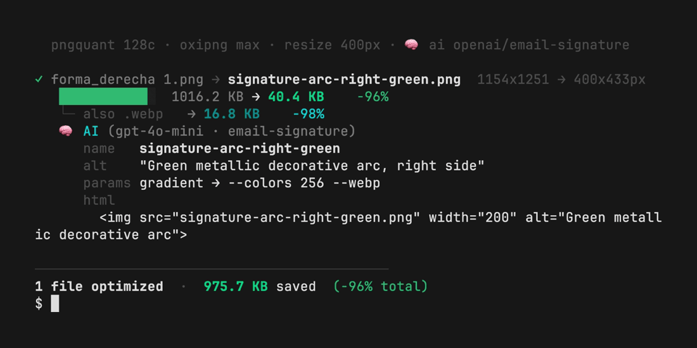

# squish

[](https://github.com/cesaramirez/squish/actions/workflows/ci.yml)
[](LICENSE)


A tiny, fast image optimizer for the terminal — resize, compress, and rename
images while keeping transparency. Output stays **PNG** for maximum
compatibility (Outlook desktop, older webmails, everything), with an optional
**WebP** sibling. Optionally uses **vision AI** (OpenAI or Claude) to suggest a
semantic filename, alt text, optimal parameters, and a ready-to-paste HTML
snippet — tuned per context (email signature, web, hero, icon, avatar).



No banding on gradients, no bloated files, no `%20` in your URLs.

## Why

Most "optimize this image" advice stops at compression. The biggest win is
almost always **shipping the image at its display size** — a 1000px asset shown
at 200px is wasting 96% of its bytes no matter how well you compress it. `squish`
does both, keeps the file email/web-safe, and gives it a clean URL-safe name.

## Install

One-liner (copies `squish` to a bin dir on your `PATH` and checks deps):

```bash
curl -fsSL https://raw.githubusercontent.com/cesaramirez/squish/main/install.sh | bash
```

Or do it by hand. Requires **pngquant** and **oxipng**; optional tools unlock
extra flags.

**macOS** (with [Homebrew](https://brew.sh)):

```bash
brew install pngquant oxipng
brew install webp jq        # optional: --webp and --ai
```

**Linux** (Debian/Ubuntu):

```bash
sudo apt install pngquant imagemagick webp jq
# oxipng: cargo install oxipng   (or grab a release binary)
```

Then put `squish.sh` on your `PATH`:

```bash
chmod +x squish.sh
ln -sf "$(pwd)/squish.sh" /opt/homebrew/bin/squish   # macOS (Apple Silicon)
# or
ln -sf "$(pwd)/squish.sh" /usr/local/bin/squish      # macOS Intel / Linux

squish --help
```

| Tool | Needed for | Required? |
|------|-----------|:---------:|
| `pngquant` | PNG palette compression | ✅ |
| `oxipng` | PNG lossless recompression | ✅ |
| `imagemagick` | resize on Linux, JPEG, `--avif` | recommended |
| `sips` | resize on macOS (built in) | — |
| `cwebp` | `--webp` (or ImageMagick) | optional |
| `curl` + `jq` | `--ai` (vision analysis) | optional |

> **Cross-platform**: resizing uses `sips` on macOS and ImageMagick everywhere
> else. Install ImageMagick on Linux and `--width`, JPEG, and `--avif` all work.

## Usage

```bash
squish image.png                          # → image.png (URL-safe slug name)
squish photo.jpg                           # JPG in, JPG out (progressive, tuned)
squish image.png -w 400                    # resize to 400px wide, then compress
squish image.png --retina --display 200    # 2× of a 200px display size → 400px
squish image.png --webp --avif             # also write .webp and .avif siblings
squish *.png -w 400 --out-dir dist         # batch into ./dist/
squish assets/*.png --dry-run              # preview names/sizes, write nothing
squish photo.jpg --ai                      # AI: suggest name / alt / params / html
squish arc.png --ai --context email-signature --apply
```

The output shows, per file: before→after dimensions, a savings bar, the byte
sizes, any `.webp`/`.avif` siblings, and a final total. Color turns off
automatically when piped or in CI.

### Formats

| Input | Output | Engine |
|-------|--------|--------|
| PNG | PNG (keeps alpha) | pngquant + oxipng |
| JPG / JPEG | JPG (progressive) | ImageMagick |
| any of the above | `.webp` sibling (`--webp`) | cwebp, or ImageMagick |
| any of the above | `.avif` sibling (`--avif`) | ImageMagick |

### Options

| Flag | What it does |
|------|--------------|
| `-w, --width N`     | Resize to N px wide (keeps aspect ratio). **The biggest win** — ship at ~2× display size. Never upscales past the source. |
| `-r, --retina`      | With `--display`, targets 2× that width. Shorthand for `--width`. |
| `--display N`       | Intended on-screen width (px). With `--retina`, resizes to `2×N`. |
| `-c, --colors N`    | PNG palette size (default 128). Lower = smaller & more banding. 128 ≈ no visible loss; 64 = aggressive. |
| `--jpeg-quality N`  | JPEG output quality 1–100 (default 82). |
| `--webp`            | Also emit a `.webp` (~40% smaller). Needs a `<picture>` fallback — Outlook can't read WebP. |
| `--avif`            | Also emit an `.avif` (~50% smaller). Needs ImageMagick built with AVIF support. |
| `--dry-run`         | Print what would happen (names, sizes) without writing any file. |
| `-d, --out-dir DIR` | Write all outputs into DIR (created if missing). |
| `-o, --output F`    | Explicit output path (single input; overrides naming). |
| `--name-as WHAT`    | How to name outputs (see below). Default: `slug`. |
| `--rename NAME`     | Replace the base name entirely (single input; slugified). |
| `--ai`              | Analyze the image with vision AI and print suggestions (see AI section). |
| `--ai-provider P`   | `auto` (default) / `openai` / `anthropic`. `auto` uses whichever key is set. |
| `--context WHAT`    | What the image is for: `auto` (default under `--ai`) / `general` / `email-signature` / `web` / `hero` / `icon` / `avatar`. |
| `--ai-fields L`     | Comma list of fields to request (default `name,alt,params,html`). |
| `--apply`           | Apply the AI-suggested name automatically (implies `--ai`); works on batches with collision suffixes. |
| `--ai-model M`      | Model override (default `gpt-4o-mini` / `claude-haiku-4-5`). |
| `--no-cache`        | Bypass the AI result cache (`~/.cache/squish/`). |
| `--no-color`        | Disable color (also respects `NO_COLOR`). |
| `-q, --quiet`       | Only print the per-file result lines. |
| `-h, --help`        | Help. |

### Recursive (`-R`)

Pass a directory with `-R` (or `--recursive`) to optimize every supported image
inside it, at any depth:

```bash
squish assets/ -R --webp
```

It discovers `.png`, `.jpg`, and `.jpeg` files (case-insensitive), skips
everything else and any hidden directory (`.git/`, `.cache/`), and does not
follow symlinks. Outputs are written in place, next to each source.

With `--out-dir`, the source tree is mirrored into the target:

```
assets/logo.png      →  dist/logo.png
assets/ui/icon.png   →  dist/ui/icon.png
```

```bash
squish assets/ -R --out-dir dist/
```

(`-r` remains `--retina`; the recursive short flag is the capital `-R`.)

### Project config (`.squishrc`)

Drop a `.squishrc` in a project directory to persist default flags, so you don't
retype them every run. It's a flat `key=value` file; lines starting with `#` are
comments. Only `./.squishrc` (the current directory) is read.

```ini
# .squishrc — defaults for this project
colors=64
webp=1
ai=1
context=email-signature
out_dir=dist
```

**Precedence:** CLI flags override `.squishrc`, which overrides built-in defaults.

| Source            | Wins over        |
|-------------------|------------------|
| CLI flag          | everything       |
| `./.squishrc`     | built-in default |
| built-in default  | —                |

Supported keys: `colors`, `width`, `webp`, `avif`, `jpeg_quality`, `name_as`,
`out_dir`, `ai`, `context`, `ai_provider`, `ai_model`, `ai_fields`, `no_cache`,
`quiet`, `no_color`. Per-invocation actions (`--output`, `--rename`, `--apply`,
`--dry-run`, and the input files) are CLI-only. Unknown keys and invalid values
are warned and skipped; the file is never executed.

### Output naming (`--name-as`)

With `"forma_derecha 1.png"` and `-w 400`:

| Value | Result | Use |
|-------|--------|-----|
| `slug` (default) | `forma-derecha-1.png` | **URL-safe** (no spaces/accents/uppercase) |
| `optimized` | `forma_derecha 1.optimized.png` | keeps the original name + suffix |
| `plain` | `forma_derecha 1.png` | original name as-is |
| `retina` | `forma-derecha-1@2x.png` | for `srcset` / retina |
| `width` | `forma-derecha-1-400w.png` | multiple widths |

> Never overwrites the source: if the output name collides with the input in the
> same folder, it appends `-min` (e.g. `logo.png` → `logo-min.png`).

`--rename` replaces the base name completely:

```bash
squish "forma_derecha 1.png" --retina --display 200 \
  --rename signature-arc-right --name-as retina
#   → signature-arc-right@2x.png
```

> `slug`/`retina`/`width` clean the name for bucket/URL use: `Árbol Décor.png`
> becomes `arbol-decor.png`. Recommended whenever the image is served over HTTP —
> a space becomes `%20` and causes problems.

## AI analysis (`--ai`)

With `--ai`, after optimizing, the image is sent to a vision model that returns
structured JSON and prints it as suggestions:

```bash
squish arc.png -w 400 --ai --context email-signature
```

### Modes

`--ai` **works with or without an API key**:

- **With a key** (OpenAI or Anthropic): full AI analysis — semantic name, alt
  text, optimal parameters (colors, webp, avif), and a ready-to-paste HTML
  snippet tuned to context.
- **Without a key** (local mode): an ImageMagick heuristic detects the image
  `kind` (photo/logo/gradient/icon) and suggests optimal `--colors` and
  `--webp`/`--avif` flags. Prints `🔍 auto (local)`.

### Providers & keys

| Provider | Env var | Default model |
|----------|---------|---------------|
| OpenAI | `OPENAI_API_KEY` | `gpt-4o-mini` |
| Anthropic | `ANTHROPIC_API_KEY` | `claude-haiku-4-5` |

By default (`--ai-provider auto`) it uses **OpenAI if `OPENAI_API_KEY` is set**,
otherwise Anthropic. Force one with `--ai-provider openai|anthropic`. Both are
cheap for this task (classifying one small image). If no key or tools are
present, `--ai` warns and skips — **the optimization still runs**.

```bash
squish photo.jpg --ai                 # no key → local heuristic; with key → full AI
export OPENAI_API_KEY="sk-..."        # or ANTHROPIC_API_KEY
squish photo.jpg --ai --apply         # apply the suggested name
squish arc.png --ai --context email-signature
squish icon.png --ai --ai-fields name,alt
```

### Context inference (`--context`)

Under `--ai`, if you don't pass `--context`, it defaults to `auto` — the model
infers whether the image is an avatar, hero, icon, web image, email signature,
or general. You can still override with an explicit `--context web` etc.

### Caching

AI results are cached by default (in `~/.cache/squish/`, keyed by image content
hash + model + context + fields). Subsequent runs on the same image with the
same settings re-use the cache. To bypass: `--no-cache`.

### Batch mode

`--apply` works on multiple inputs. When output names collide, the script adds
numeric suffixes: `name.png`, `name-2.png`, `name-3.png`, etc.

### What it returns (`--ai-fields`)

| Field | What it is |
|-------|------------|
| `name` | URL-safe semantic slug. With `--apply`, becomes the output name. |
| `alt` | Alt text for the `` (accessibility). |
| `params` | Classifies the image (photo/logo/gradient/…) and suggests `--colors` and whether `--webp` helps. |
| `html` | Ready-to-paste HTML snippet, tuned to `--context`. |

> **Security**: keys are read from the environment, never stored in the script or
> printed. Don't commit keys — use a git-ignored `.env`/`.dev.vars`, or export
> them in your shell.

## Recommended for email signatures

- Export the image at **~2× its on-screen width** (shown at 200px → `-w 400`).
- Put the display width in the HTML: `` — crisp on
  retina.
- Serve it with a long cache: `Cache-Control: public, max-age=31536000, immutable`.
- Keep the output PNG — Outlook desktop and several webmails don't render WebP.

Real example: a 1016 KB / 1154px asset → **40 KB** at `-w 400` (−96%).

## How it works

1. Optional resize (`sips` on macOS, ImageMagick elsewhere) — never upscales.
2. Compress by format: PNG via `pngquant` (palette, keeps alpha) + `oxipng -o max`
   (lossless); JPEG via ImageMagick (progressive, tuned quality).
3. Optional `.webp` / `.avif` siblings.
4. Optional AI pass: sends the resized image to the vision model with a strict
   JSON schema and prints the suggestions.

## Use in CI (GitHub Action)

Optimize images automatically in pull requests:

```yaml
- uses: cesaramirez/squish@v0.2.0
  with:
    files: "assets/**/*.png"
    webp: "true"
```

See [docs/USING_THE_ACTION.md](docs/USING_THE_ACTION.md) for a full workflow.

## Install via Homebrew

```bash
brew install cesaramirez/tap/squish
```

See [docs/HOMEBREW.md](docs/HOMEBREW.md) for tap setup.

## Contributing

Issues and PRs welcome — see [CONTRIBUTING.md](CONTRIBUTING.md). CI runs
ShellCheck and a [bats](https://github.com/bats-core/bats-core) test suite on
every push.

## License

[MIT](LICENSE) © César
